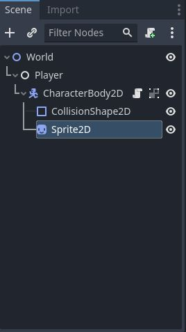

# Godot Top-Down Player Movement

In this project, you can find a simple top-down player movement example.

## The Process

1. Create a new Godot project.
2. Create a new 2D scene. (I named it as World)
3. Create a Empty Node. (I named it as Player)
4. Create a CharacterBody2D under Empty Node.
5. Create a CollisionShape2D and assign Shape as Rectangle.
6. Create a Sprite2D and change its Texture whatever sprite you see fit.
7. Attach a script to CharacterBody2D and add following GDScript code.

```
extends CharacterBody2D

# Player speed (adjust as needed)
@export var speed = 20

func _process(delta):
	# Player movement
	var movement = Vector2()  # Initialize movement vector

	if Input.is_action_pressed("ui_right"):
		movement.x += 1
	if Input.is_action_pressed("ui_left"):
		movement.x -= 1
	if Input.is_action_pressed("ui_down"):
		movement.y += 1
	if Input.is_action_pressed("ui_up"):
		movement.y -= 1

	# Normalize the movement vector to prevent faster movement diagonally
	movement = movement.normalized()

	# Move the player
	move_and_collide(movement * speed)
```

([Click](scripts/player_movement.gd) to check the script)

## Scene Editor SS


